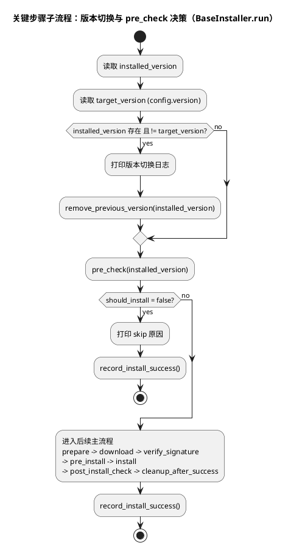
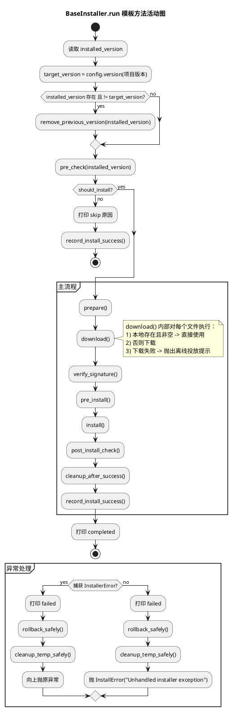
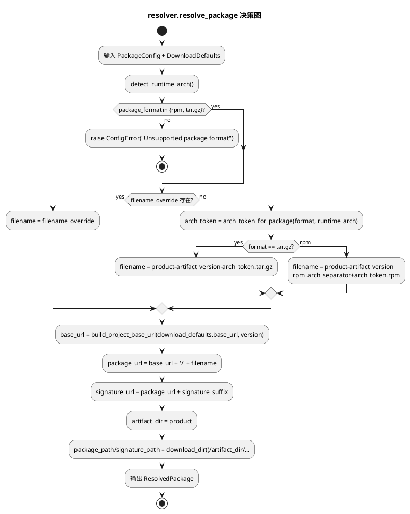
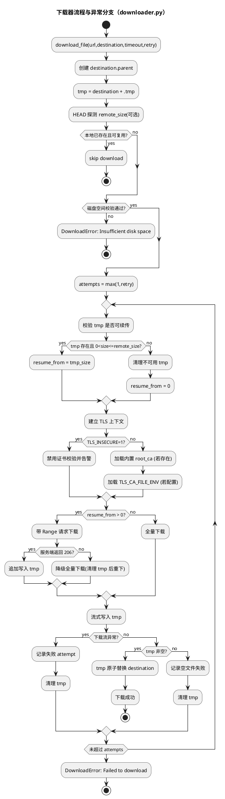
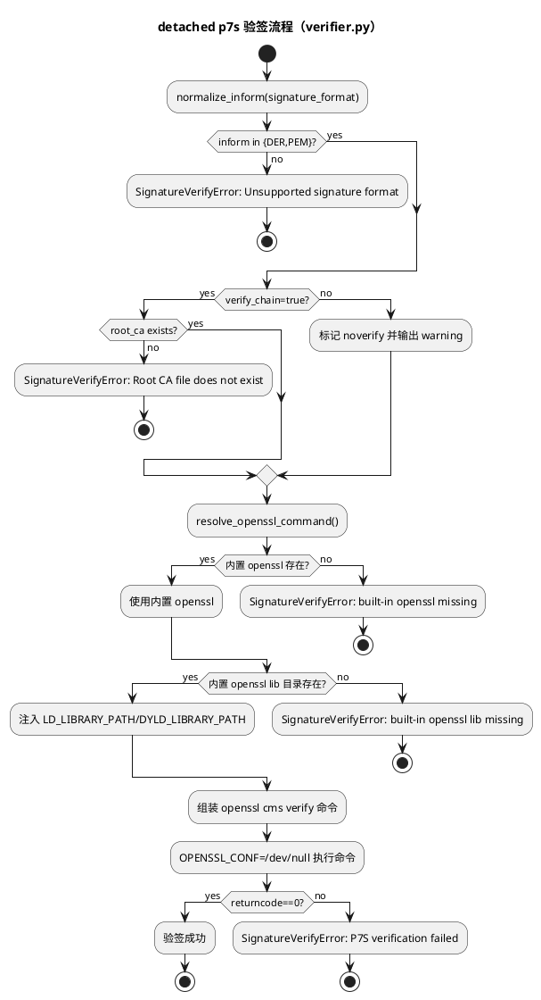
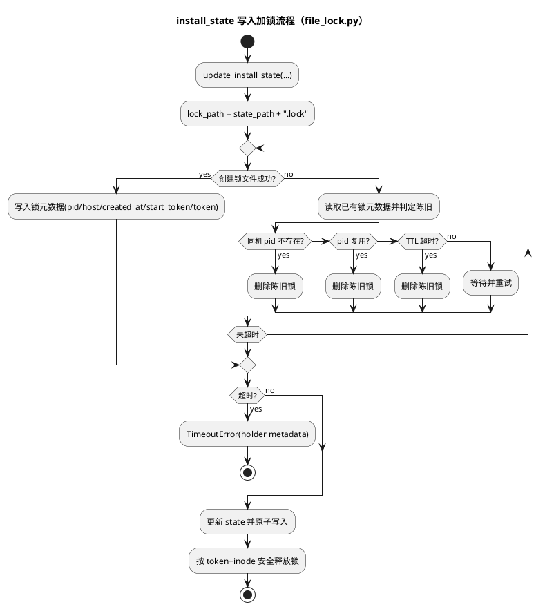

# package-manager 详细设计文档

## 一、整体流程

### 1.1 总流程

#### 1.1.1 流程图

```puml
@startuml

title 运行期整体流程图

start

:接收安装请求（name）;
if (输入有效?) then (是)
else (否)
  :配置错误退出;
  stop
endif

:加载并校验运行配置;
if (配置可用?) then (是)
else (否)
  :配置错误退出;
  stop
endif

:按 name 选择目标产品;
if (命中可安装产品?) then (是)
else (否)
  :配置错误退出;
  stop
endif

:解析目标包信息
(架构/文件名/下载地址/本地缓存路径);
if (解析成功?) then (是)
else (否)
  :配置错误退出;
  stop
endif

:读取已安装状态;
if (检测到版本切换?) then (是)
  :清理旧版本;
else (否)
endif

:执行 pre-check;
if (满足跳过条件?) then (是)
  :刷新成功状态;
  :成功退出;
  stop
else (否)
endif

:准备安装环境;

:获取主包与签名
(本地命中优先, 否则下载);
if (获取失败?) then (是)
  :下载错误退出
(附离线投放提示);
  stop
else (否)
endif

if (存在附加依赖包?) then (是)
  :获取附加依赖包与签名;
  if (获取失败?) then (是)
    :下载错误退出
(附离线投放提示);
    stop
  else (否)
  endif
else (否)
endif

:执行签名校验;
if (验签通过?) then (是)
else (否)
  :验签错误退出;
  stop
endif

:执行安装;
if (安装成功?) then (是)
else (否)
  :回滚与临时清理;
  :安装错误退出;
  stop
endif

:安装后校验;
if (校验通过?) then (是)
else (否)
  :回滚与临时清理;
  :安装错误退出;
  stop
endif

:清理阶段;
if (cache_policy=keep_latest?) then (是)
  :仅保留最新包和签名缓存;
else (否)
  :清理下载缓存目录;
endif

:写入成功状态(install_state + 文件锁);
if (锁获取/状态写入成功?) then (是)
  :成功退出;
  stop
else (否)
  :安装错误退出;
  stop
endif

@enduml
```



#### 1.1.2 流程图解释

配置文件

```yaml
download_defaults:
  base_url: "https://kunpeng-repo.obs.cn-north-4.myhuaweicloud.com/Kunpeng%20DevKit/Kunpeng%20DevKit%20"
  signature_suffix: ".p7s"
  timeout_seconds: 300
  retry: 3

verify_defaults:
  signature_type: "p7s"
  signature_format: "DER"
  verify_chain: true

packages:
  # 可选字段示例（按需开启）：
  # filename_override: "custom-file-name.tar.gz"
  # 用途：当上游包名不符合默认拼接规则时，显式指定完整文件名。
  - product: "DevKit-Porting-Advisor"
    project_version: "26.0.RC1"
    artifact_version: "26.0.RC1"
    supported_versions:
      - "26.0.RC1"
    package_format: "tar.gz"
    install_dir: "_internal/porting_cli"
    enabled: true
```

1. 读取并解析配置文件
2. 根据当前运行架构、版本号等信息获取文件名，并根据文件名根baseurl获取包及签名下载链接
3. 执行安装流程
   1. 读取安装状态 `installed_version`
   2. 若检测版本切换，先执行旧版本删除
   3. 执行 pre-check 判断是否跳过
   4. 需要安装时：下载（离线优先）-> 验签 -> 安装 -> 安装后校验 -> 清理（含 `keep_latest` 分支）
   5. 成功后写入 `.package-manager/.install_state.yaml`（写入加锁，支持陈旧锁清理）
   6. 任何异常走统一处理：回滚、临时目录安全清理、映射退出码

### 1.3 关键分支总览（总流程级）

| 分支域 | 关键决策点 | 结果 |
|---|---|---|
| 参数分支 | 未提供 `--name` | `ConfigError(10)` |
| 选包分支 | `--name` 不匹配启用项 | `ConfigError(10)` |
| 解析分支 | 架构不支持 | `ConfigError(10)` |
| 解析分支 | `filename_override` 存在 | 优先使用 override 文件名 |
| 离线分支 | 本地文件存在且非空 | 直接复用，不下载 |
| 下载分支 | 网络失败且重试耗尽 | `DownloadError(20)` + 离线提示 |
| 验签分支 | 签名格式非法或验签失败 | `SignatureVerifyError(40)` |
| 配置分支 | 内置根证书缺失 | `ConfigError(10)` |
| pre-check 分支 | 同版本且结构完整 | 跳过安装并刷新成功状态 |
| 版本切换分支 | `installed_version != target version` | 先清理旧版本 |
| 状态写入分支 | 活锁超时/状态写入异常 | 包装为 `InstallError(50)` |
| 下载分支 | 命中 `.tmp` 且服务端支持 Range | 断点续传 |
| 缓存分支 | `cache_policy=keep_latest` | 成功后保留最新包和签名 |
| 未知异常分支 | 非 `InstallerError` | 包装为 `InstallError(50)` |

---

## 二、模块设计

### 2.1 部署结构（构建产物结构）

#### 2.1.1 构建后目录结构server

```text
├── server                   # 主程序可执行文件
├── config/
│   └── packages.yaml                 # 构建期渲染后的运行配置
├── .package-manager/                 # 运行时隐藏状态目录（首次成功安装后生成）
│   └── .install_state.yaml           # 已安装版本/安装结果记录
└── _internal/
    ├── openssl/
    │   ├── bin/openssl              # openssl 可执行文件
    │   ├── lib/                     # libssl/libcrypto 动态库
    │   └── pems/
    │       └── huawei_integrity_root_ca_g2.pem # 验签根证书文件
    └── packages/                    # 下载缓存目录（运行时使用，成功后清理）
```

#### 2.1.2 部署项职责说明

| 路径 | 类型 | 作用 | 运行期是否必需 |
|---|---|---|---|
| `dist/package-manager/package-manager` | 可执行文件 | CLI 入口与完整安装编排 | 是 |
| `dist/package-manager/config/packages.yaml` | 配置 | 定义产品、版本、下载默认项、验签默认项 | 是 |
| `dist/package-manager/_internal/openssl/bin/openssl` | 二进制 | 验签命令执行体 | 是 |
| `dist/package-manager/_internal/openssl/lib/*` | 动态库 | 保证 openssl 使用内置 libssl/libcrypto | 是 |
| `dist/package-manager/_internal/openssl/pems/huawei_integrity_root_ca_g2.pem` | 证书 | 证书链校验根证书 | 是（verify_chain=true） |
| `dist/package-manager/_internal/packages/` | 目录 | 下载缓存与离线投放目录 | 是 |
| `dist/package-manager/_internal/porting_cli/` | 安装目标目录（示例） | 某些产品安装成品输出目录 | 按配置决定 |

### 2.2 代码结构（仅 src）

#### 2.2.1 文件级职责表

| 文件 | 角色 | 主要职责 | 不负责内容 |
|---|---|---|---|
| `src/package_manager/main.py` | CLI 入口 | 参数解析、统一异常映射、退出码返回 | 业务安装逻辑 |
| `src/package_manager/service.py` | 编排层 | 配置加载、按 name 选包、调度安装器 | 文件下载/验签细节 |
| `src/package_manager/config.py` | 配置层 | YAML 读取、Pydantic 校验、RuntimeConfig 构建与缓存 | 安装流程执行 |
| `src/package_manager/models.py` | 模型层 | 运行时 dataclass 数据契约 | I/O 与业务判断 |
| `src/package_manager/constants.py` | 常量层 | 架构、包格式、产品名等常量统一定义 | 业务流程 |
| `src/package_manager/paths.py` | 路径层 | 打包态/开发态路径解析、内部目录定位 | 业务逻辑 |
| `src/package_manager/resolver.py` | 解析层 | 架构识别、文件名规则、下载 URL/本地路径解析 | 下载传输 |
| `src/package_manager/downloader.py` | 下载层 | HEAD 探测、磁盘预检、重试下载、原子替换 | 产品安装语义 |
| `src/package_manager/verifier.py` | 安全层 | P7S detached 验签、内置 openssl 调用、库路径注入 | 下载与解压 |
| `src/package_manager/install_state.py` | 状态层 | `.install_state.yaml` 读取/更新/原子写 | 包解析与安装 |
| `src/package_manager/file_lock.py` | 并发控制层 | 文件锁、陈旧锁判定（pid/复用/TTL）、安全释放 | 安装业务编排 |
| `src/package_manager/installer/base.py` | 安装器基类层 | 模板方法、成功清理策略、异常回滚清理 | CLI 参数处理 |
| `src/package_manager/installer/registry.py` | 安装器注册层 | 安装器注册表与外部插件自动发现 | 安装执行细节 |
| `src/package_manager/installer/utils.py` | 安装器工具层 | 离线优先下载、目录重置、rpm/tar 通用工具 | CLI 参数处理 |
| `src/package_manager/installer/porting_advisor.py` | 产品安装器层 | Porting-Advisor tar 包安装实现 | 通用框架逻辑 |
| `src/package_manager/installer/porting_cli.py` | 产品安装器层 | devkit-porting rpm + framework 安装实现 | 通用框架逻辑 |
| `src/package_manager/errors.py` | 错误契约层 | 统一错误类型和退出码 | 业务执行 |
| `src/package_manager/build_config_renderer.py` | 构建期工具 | 模板 YAML 渲染（替换 `${PACKAGE_VERSION}`） | 运行期安装 |


### 2.3 类图及文字描述

#### 2.3.1 类图

1. [core_class_detail.puml](/Users/fxl/pycharm_projects/package/docs/puml/core_class_detail.puml)

1. 分层结构：
   1. `main -> service -> resolver/installer -> downloader/verifier/state` 单向依赖，避免环依赖。
   2. 上层只编排不做底层细节，下层只做单一职责能力。
2. 数据驱动思路：
   1. `PackageConfig` 与 `ResolvedPackage` 分离，前者描述配置语义，后者描述执行语义。
   2. 双版本字段（`version`/`artifact_version`）避免目录版本与文件版本混淆。
3. 设计模式：
   1. 模板方法模式：`BaseInstaller.run()` 固化主流程，子类只实现差异点（`pre_check/install/rollback`）。
   2. 工厂模式：`get_installer_class()` 通过注册表按 `(product, format)` 返回安装器，避免 `if-else` 扩散。
   3. 策略组合思想：`ensure_local_or_download`、`verify_p7s_detached`、`resolve_package` 作为可复用能力，以组合方式接入安装流程。
   4. 异常语义模式：统一 `InstallerError` 分层异常 + 退出码映射，实现稳定外部契约。
4. 后续扩展方式：
   1. 新增产品（不新增包格式）：
      1. 在 YAML 增加 product 配置项。
      2. 在 `src/package_manager/installer/` 新增产品安装器子类并通过 `registry.py` 自动发现注册。
   2. 新增包格式：
      1. 在 `constants.py` 扩展格式常量。
      2. 在 `resolver.py` 增加文件名与架构 token 规则。
      3. 增加对应中间安装器或产品安装器实现。
   3. 新增验签机制：
      1. 在 `verifier.py` 增加新验证函数。
      2. 在 `installer/base.py` 的 `verify_signature` 阶段按配置选择调用。
   4. 新增 pre-check 规则：
      1. 优先在具体产品安装器重写 `pre_check`，避免污染 `BaseInstaller` 通用模板。
5. 设计守则：
   1. 新功能尽量通过“新增模块/子类/注册表项”实现，避免在已有主流程中堆叠分支。
   2. 对外行为变化必须同时更新 `errors.py` 语义和 E2E 场景矩阵。

#### 2.3.2 关键类与关系说明

| 类/模块 | 类型 | 关键字段/方法 | 关系与设计意图 |
|---|---|---|---|
| `RuntimeConfig` | 聚合数据对象 | `download_defaults`/`verify_defaults`/`packages` | 作为运行时单一配置快照，避免跨模块重复读取 YAML |
| `PackageConfig` | 数据对象 | `product`、`version`、`artifact_version`、`install_dir` | 统一产品契约，消除散落字符串参数 |
| `ResolvedPackage` | 数据对象 | `filename`、`package_url`、`signature_url`、`package_path` | 将“可执行下载上下文”一次性解析出来，后续模块只消费结果 |
| `BaseInstaller` | 模板父类 | `run()`、`pre_check()`、`install()`、`rollback()` | 固定主流程顺序，所有产品共享一致的错误处理框架 |
| `TarGzInstaller` | 抽象中间实现 | `install()`、`remove_previous_version()` | 封装 tar.gz 通用流程，减少产品子类重复 |
| `RpmInstaller` | 抽象中间实现 | `install()`、`post_install_check()` | 封装 rpm 通用安装/校验流程 |
| `PortingAdvisorTarGzInstaller` | 产品实现 | payload 识别、二层包提取、运行时布局发布 | 将产品特殊手工步骤隔离在子类中 |
| `PortingCliRpmInstaller` | 产品实现 | framework 包下载/验签/安装、目录整理 | 处理双 rpm 依赖关系与发布目录整理 |
| `ConfigNode`/`PackageNode` | Pydantic 校验模型 | 字段类型、必填、枚举、版本约束 | 在配置入口提前失败，防止运行期进入脏数据 |
| `InstallerError` 家族 | 错误契约 | `exit_code` | 全局可观测错误语义与退出码一致性 |

### 2.4 关键步骤与子流程图

#### 2.4.1 关键步骤定义

关键步骤选择为“版本切换 + pre_check 决策”，原因如下：

1. 这是安装执行前的核心分叉点，直接决定“重装、跳过、继续安装”的路径。
2. 该步骤同时关联状态文件、目录清理与幂等策略，是稳定性风险最高的环节之一。

#### 2.4.2 子流程图

1. [precheck_version_switch_activity.puml]

2. [installer_template_activity.puml]

3. [resolver_decision_activity.puml]

4. [offline_local_or_download_activity.puml]
```plantuml
@startuml

title 离线优先决策流程（ensure_local_or_download）

start
:输入 url + destination;

if (destination 存在且是文件?) then (yes)
  if (size > 0?) then (yes)
    :打印 "Use local artifact file";
    :直接返回;
    stop
  else (no)
    :判定为空文件，视为不可用;
  endif
else (no)
endif

:调用 downloader.download_file(...);
if (下载成功?) then (yes)
  :返回;
  stop
else (no)
  :包装 DownloadError;
  :附加离线提示：
  note right
    Offline install hint:
    place file at <destination>
    and rerun.
  end note
  :抛出 DownloadError(20);
  stop
endif

@enduml
```
5. [downloader_activity.puml]

6. [verifier_activity.puml]

7. [install_state_lock_activity.puml]



#### 2.4.3 子流程要点说明

| 子流程节点 | 设计意图 | 对应实现点 |
|---|---|---|
| 读取 `installed_version` | 将历史状态与目标状态显式对比 | `BaseInstaller.recorded_installed_version()` |
| 版本不一致先清理旧版本 | 避免旧版本残留影响新版本安装 | `remove_previous_version(installed_version)` |
| 执行 pre_check | 在昂贵动作前做快速判定 | `pre_check()` |
| pre_check 命中 skip | 保持幂等并快速返回 | `record_install_success()` + return |
| pre_check 放行安装 | 进入完整主流程 | `prepare -> download -> verify -> install ...` |

---

## 三、安全设计

### 3.1 安全问题与防护矩阵

| 安全问题 | 风险描述 | 触发面 | 当前防护设计 | 仍需关注点 |
|---|---|---|---|---|
| 包篡改 | 下载文件被替换或中间人篡改 | 下载链路 | 强制 P7S detached 验签；默认 `verify_chain=true` | 证书更新流程需要运维化 |
| 根证书缺失 | 验签链无法建立导致误用不可信包 | 部署/构建 | `root_ca_path()` 仅使用内置证书，缺失即失败 | 构建产物必须校验证书存在 |

### 3.2 退出码

| 退出码 | 错误类型 | 语义 |
|---|---|---|
| `10` | `ConfigError` | 输入配置或环境不可信，阻断执行 |
| `20` | `DownloadError` | 远端不可达或下载不可用，未进入安装 |
| `40` | `SignatureVerifyError` | 完整性/信任链校验失败，拒绝安装 |
| `50` | `InstallError` | 安装执行过程失败，需排查系统状态 |
| `60` | `CleanupError` | 主流程成功但清理失败，需人工处理残留 |
| `1` | 其他异常 | 未归类异常兜底 |

---

## 四、测试用例设计

### 4.1 测试分层与执行入口

| 层级 | 目标 | 入口 |
|---|---|---|
| UT | 校验函数/模块逻辑与边界分支 | `pytest -q` |
| IT/E2E | 校验构建产物在真实环境全链路行为 | `./scripts/e2e_cases.sh [--container <name>]` |

### 4.2 UT 用例设计（按文件）

| 用例文件 | 覆盖模块 | 关键场景 | 通过标准 |
|---|---|---|---|
| `tests/test_config_runtime.py` | `config.py` | YAML 解析错误、字段缺失、版本不在支持范围、rpm 分隔符非法 | 抛出 `ConfigError(10)` 且错误信息匹配 |
| `tests/test_resolver.py` | `resolver.py` | 双版本语义、rpm `-`/`.` 规则、架构 token、URL 拼接 | 解析结果 `filename/package_url/path` 精确匹配 |
| `tests/test_porting_cli_urls.py` | `resolver.py` + `installer/porting_cli.py` | devkit framework URL 必须跟随项目版本目录 | URL 与预期完全一致 |
| `tests/test_downloader.py` | `downloader.py` | 重试、空间不足、空文件、防重复下载、断点续传、TLS 分支 | 抛错类型与日志证据符合预期 |
| `tests/test_p7s_verifier.py` | `verifier.py` | 格式非法、根证书缺失、链校验开关、命令失败 | 返回成功或抛出 `SignatureVerifyError(40)` |
| `tests/test_install_state.py` | `install_state.py` | 状态读取、损坏 YAML、原子写后读回 | 状态字段与写入值一致 |
| `tests/test_file_lock.py` | `file_lock.py` | 死进程锁回收、TTL 回收、活锁超时保护 | 锁行为符合预期，不误删活锁 |
| `tests/test_installer_flow.py` | `installer/base.py` | pre-check skip、版本切换、安装失败回滚、清理失败保护主错误 | 调用序列与最终异常符合模板方法预期 |
| `tests/test_installer_service.py` | `service.py` | `--name` 选择逻辑、空值校验、无匹配产品 | 抛 `ConfigError(10)` 或返回 0 |
| `tests/test_main.py` | `main.py` | 参数透传、异常映射退出码 | 退出码稳定 |
| `tests/test_paths.py` | `paths.py` | 打包态/开发态路径解析、配置路径优先级 | 路径选择符合设计 |
| `tests/test_porting_advisor_layout.py` | `installer/porting_advisor.py` | Porting Advisor 成品布局校验与提取流程 | `config/jre/jar` 布局可验证 |
| `tests/test_registry.py` | `installer/registry.py` | 安装器注册映射与未知映射异常 | 返回正确安装器类型或 `ConfigError` |

### 4.3 IT/E2E 用例设计（场景矩阵）

执行脚本：`scripts/e2e_cases.sh`

| 场景ID | 场景说明 | 目标分支 | 预期结果 |
|---|---|---|---|
| S01 | Porting-Advisor 首次安装 | pre-check install | `rc=0` 且出现 `Installer run completed` |
| S02 | Porting-Advisor 同版本重复安装 | pre-check skip | `rc=0` 且出现 `Installer pre-check hit` |
| S03 | devkit-porting 首次安装 | rpm + framework 全链路 | `rc=0` |
| S04 | devkit-porting 同版本重复安装 | pre-check skip | `rc=0` 且 skip 证据 |
| S05 | 项目版本不在 `supported_versions` | config 版本约束 | `rc=10` |
| S06 | 低版本切到目标版本 | version switch | `rc=0` 且出现切换日志 |
| S07 | 高版本切到目标版本 | version switch | `rc=0` 且出现切换日志 |
| S08 | Porting-Advisor 成品结构校验 | post-install layout | 存在 `config/jre/sql-analysis-*.jar` |
| S09 | 成功后缓存目录清理 | cleanup_after_success | 下载目录不存在 |
| S10 | 输入不支持参数 `--package-id` | CLI 参数约束 | `rc=2` |
| S11 | install_state YAML 损坏 | 状态读取异常 | `rc=10` |
| S12 | config YAML 损坏 | 配置解析异常 | `rc=10` |
| S13 | 下载地址不可达 | download fail + 离线提示 | `rc=20` 且含 `Offline install hint` |
| S14 | 错误 `signature_format` 触发验签失败 | verifier fail | `rc=40` |
| S15 | 伪造不支持架构 | resolver arch fail | `rc=10` |
| S16 | 同版本但安装目录缺失 | pre-check 需重装 | `rc=0` 且不能 skip |
| S18 | devkit-porting 目录整理失败 | install fail | `rc=50` |
| S19 | 根证书缺失 | config/root_ca fail | `rc=10` |
| S20 | 清理失败路径 | safe cleanup & wrap | `rc=50` 且主错误不被覆盖 |
| S21 | PA 包+签名本地命中，网络不可达 | offline local hit | `rc=0` 且出现 `Use local artifact file` |
| S22 | PA 主包命中，签名缺失可在线补齐 | mixed local/online | `rc=0` |
| S23 | PA 主包为空且网络不可达 | offline fail hint | `rc=20` 且提示投放路径 |
| S24 | PA 主包缺失且网络不可达 | offline fail hint | `rc=20` 且提示投放路径 |
| S25 | DP 四文件本地命中且网络不可达 | offline full local | `rc=0` |
| S26 | DP framework 主包缺失但网络可达 | mixed local/online | `rc=0` |
| S27 | DP framework 主包缺失且网络不可达 | offline fail hint | `rc=20` |
| S28 | DP framework 主包空文件且网络不可达 | offline fail hint | `rc=20` |
| S29 | DP framework 签名缺失且网络不可达 | offline fail hint | `rc=20` |
| S30 | 并发状态写入锁，16 进程并发更新状态 | state lock concurrency | `rc=0` 且 state 记录完整 |
| S31 | 预置 `.tmp` 后断点续传 | HTTP Range resume | `rc=0` 且命中 `resume_from`/`206` 证据 |
| S32 | `keep_latest` 缓存策略 | cache policy | `rc=0` 且离线重装复用本地缓存 |
| S33 | 预置陈旧锁后安装 | stale lock reclaim | `rc=0` 且陈旧锁被清理 |
| S34 | 活锁保护 | live lock protect | `rc=0` 且竞争方超时、活锁不误删 |

---

## 五、MCP 控制面架构

### 5.1 设计目标
1. 让本地 `opencode` 通过自然语言调用远端包管理能力。
2. 保持“工具白名单 + 最小权限 + 可审计返回”的控制面边界。
3. 不改动安装器内核主流程，仅在控制面做编排与保护。

### 5.2 关键组件
| 组件 | 文件 | 作用 |
|---|---|---|
| MCP Server | `src/package_manager/mcp_server.py` | 暴露 `pm_*` 工具、鉴权、scope 授权 |
| Control Plane | `src/package_manager/control_plane.py` | 工具能力实现、结构化返回、安装互斥锁 |
| 启动脚本 | `scripts/start_mcp_server.sh` | 环境变量装配、鉴权模式选择 |
| Token 生成 | `scripts/generate_mcp_token.py` | HMAC 短期 token 生成 |
| Skill | `.opencode/skills/package-manager-install-guarded/SKILL.md` | 标准安装编排流程约定 |

### 5.3 工具与权限模型
| 工具名 | 动作 | 需要 scope |
|---|---|---|
| `pm_health` | 健康检查 | `pm:read` |
| `pm_list_packages` | 列包 | `pm:read` |
| `pm_status` | 状态查询 | `pm:read` |
| `pm_install` | 安装执行 | `pm:write` |
| `pm_skill_install_guarded` | 受控安装（health->list->dry-run->install->status） | `pm:write` |

### 5.4 鉴权模型
1. 静态 token：`PACKAGE_MANAGER_MCP_TOKEN` + `PACKAGE_MANAGER_MCP_TOKEN_SCOPES`。
2. HMAC 短期 token：`PACKAGE_MANAGER_MCP_HMAC_SECRET`。
3. 可组合 verifier：静态 token 与 HMAC 可同时启用。
4. 安全兜底：`auth-disabled` 默认仅允许 loopback host。

### 5.5 控制面保护机制
1. 安装互斥锁：`PACKAGE_MANAGER_INSTALL_LOCK_FILE` + `PACKAGE_MANAGER_INSTALL_LOCK_TIMEOUT_SECONDS`。
2. 命令超时：`PACKAGE_MANAGER_COMMAND_TIMEOUT_SECONDS`。
3. dry-run 模式：
   1. `command`：实际调用 `package-manager --dry-run`。
   2. `simulate`：仅模拟成功，适配老二进制。
4. 错误结构化：`lock_timeout/command_timeout/command_exec_error/command_failed`。

### 5.6 部署与时序图
- 远端部署视图：
  - [mcp_remote_deployment_view.puml](/Users/fxl/pycharm_projects/package/docs/puml/mcp_remote_deployment_view.puml)
- 受控安装时序图：
  - [mcp_guarded_install_sequence.puml](/Users/fxl/pycharm_projects/package/docs/puml/mcp_guarded_install_sequence.puml)

### 5.7 MCP 测试覆盖
| 测试文件 | 覆盖点 |
|---|---|
| `tests/test_control_plane.py` | 工具能力、安装锁、dry-run、超时错误 |
| `tests/test_mcp_server_auth.py` | 静态 token/HMAC token/组合 verifier/scope 安全策略 |
| `tests/test_mcp_server_e2e.py` | streamable-http 协议级端到端工具调用 |
